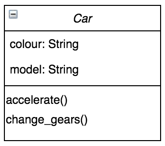
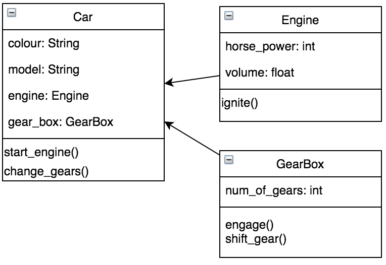

# Multiple Classes

## Preparation for Tomorrow

## Learning Objectives

- Understand the relationship between multiple classes
- Know how to use composition to design a program

## What is Composition?

Composition is one of the fundamentals of OOP (Object Oriented Programming).

As we've seen, properties of classes can be simple Strings and Integers but they are not limited to this. They can also be Lists or Dictionaries and they can even be assigned to other objects.

When a property is set to another object we call this a HAS-A relationship. If we have a class named ```Car``` and it has a property of an ```Engine``` we say the ```Car``` has an ```Engine```.

When there is a HAS-A relationship, we call this ```composition```. The ```Car``` is composed of an ```Engine```. And maybe it also has a ```GearBox``` object as one of its properties. Then the ```Car``` is composed of an ```Engine``` and a ```GearBox```.

## So What's the Big Deal?

It's an elegant way of giving an object additional behaviour!

If we think about a ```Car``` object, it can't do much without an ```Engine``` and a ```GearBox```. It could have a colour and a model but without the ```Engine``` and ```GearBox``` it doesn't have the behaviour that we want it to have. With our ```Car``` composed of an ```Engine``` and a ```GearBox``` it can actually drive.

## Composing the Car



Currently this ```Car``` class HAS-A colour and a model. Let's add an ```Engine``` and a ```GearBox```



Now can you think how the start_engine() and change_gears() methods might work?

The ```Car``` class should hand off the **responsibility** of the engine starting to the engine object itself. It might look like this:

```python
def start_engine(self):
  self.engine.ignite()
```

Similarly for the ```GearBox```

```python
def change_gears(self):
  self.gear_box.shift_gear()
```

Now we would be free to swap in and out different engine and gearbox objects (as long as they had an ignite() method and a shift_gear() method)


## Exercise

Sketch out the class diagrams for a ```Book``` class that is composed of an ```Author``` object and a ```Publisher``` object.


## Summary

We've seen how to create relationships between multiple classes using composition and we know how to use composition to design a program.

The advantages include:

1. Reuse of existing code
2. Ability to change the implementation of a class used in a composition without adapting any external clients
3. Achieves a more flexible and less rigid  design

Tomorrow we will look at coding a slightly more example using ```lists``` of objects as composition.
